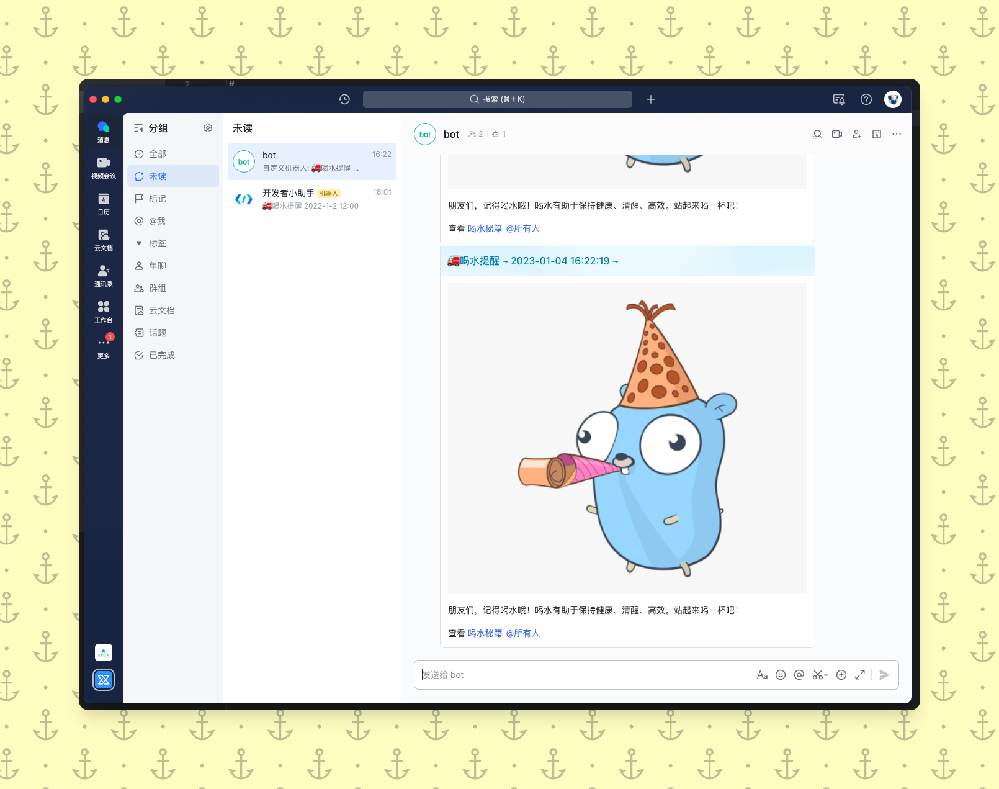

# feishu-bot-webhook

>  [Feishu](https://www.feishu.cn/) 群消息机器人，定时提醒同学喝水~

飞书的机器人有两种实现方式 一种是使用 [Webhook](https://open.feishu.cn/document/ukTMukTMukTM/ucTM5YjL3ETO24yNxkjN?lang=zh-CN) ，另一种是使用 [自定义机器人](https://open.feishu.cn/document/ukTMukTMukTM/uATM04CMxQjLwEDN) 。

本项目使用的是 Webhook 方式。

## 项目资料

- [飞书文档](https://open.feishu.cn/document/ukTMukTMukTM/ucTM5YjL3ETO24yNxkjN?lang=zh-CN)
- [feishu-go-bot](https://github.com/CatchZeng/feishu)
